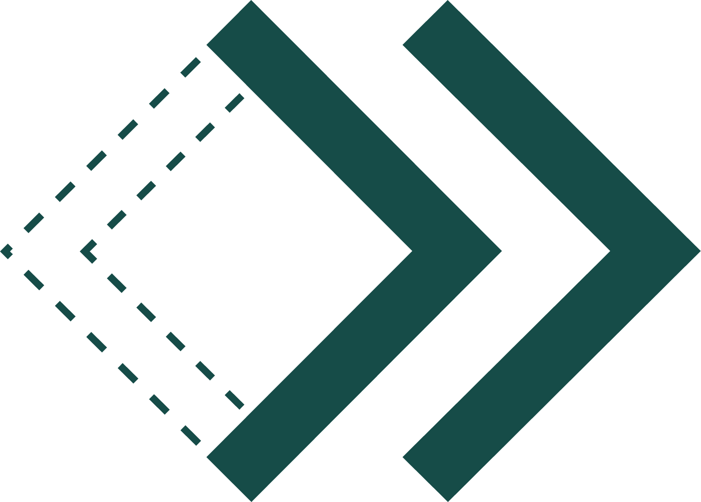

# web-lib

Component Library for GoCart's UI

<div id="top"></div>

<!-- PROJECT LOGO -->
<br />
<div align="center">
  <a href="https://github.com/GoCartPay/web-lib">
    
  </a>

<h3 align="center">web-lib</h3>

  <p align="center">
    Component Library for GoCart's React-based UI
    <br />
    <a href="https://61c388e27064e6003a60bbab-enrwpsgjbh.chromatic.com/?path=/story/introduction--page"><strong>Explore the docs »</strong></a>
    <br />
    <br />
    <a href="https://61c388e27064e6003a60bbab-enrwpsgjbh.chromatic.com/?path=/story/introduction--page">View Demo</a>
    ·
    <a href="https://github.com/GoCartPay/web-lib/issues">Report Bug</a>
    ·
    <a href="https://github.com/GoCartPay/web-lib/issues">Request Feature</a>
  </p>
</div>

<!-- TABLE OF CONTENTS -->
<details>
  <summary>Table of Contents</summary>
  <ol>
    <li>
      <a href="#about-the-project">About The Project</a> 
    </li>
    <li>
      <a href="#getting-started">Getting Started</a>
    </li>
    <li><a href="#usage">Usage</a></li>
    <li><a href="#contact">Contact</a></li>
  </ol>
</details>

<!-- ABOUT THE PROJECT -->

## About The Project

Component library based on MUI

Please note, you will need to be on node 16+ to use precommit hooks.

<p align="right">(<a href="#top">back to top</a>)</p>

### Built With

- [React](https://reactjs.org/)
- [MUI](https://mui.com/)
- [Jest](https://jestjs.io/)
- [Babel](https://babeljs.io/)
- [Typescript](https://www.typescriptlang.org/)
- [Rollup](https://www.rollupjs.org/)
- [Storybook](https://storybook.js.org/)

<p align="right">(<a href="#top">back to top</a>)</p>

<!-- GETTING STARTED -->

## Getting Started

To get a local copy up and running follow these simple example steps.

1. Clone the repo
   ```sh
   git clone git@github.com:GoCartPay/web-lib.git
   ```
2. Install NPM packages
   ```sh
   npm install
   ```
3. Explore the docs
   ```sh
   npm run storybook
   ```
4. Make some changes
5. Build the library
   ```sh
   npm run build
   ```
6. Commit the changes (including the `dist` folder)
   ```sh
   git add --all
   git commit -m "Detailed commit message"
   ```
7. Push back up to repo
   ```sh
   git push
   ```

<p align="right">(<a href="#top">back to top</a>)</p>

<!-- USAGE EXAMPLES -->

## Usage

This is a library, meant to be used within other applications.

1. Install the package
   ```sh
   npm i GoCartPay/web-lib
   ```
2. Use the components
   ```js
   import Button from @gocartpay/web-lib
   ```

<p align="right">(<a href="#top">back to top</a>)</p>

<!-- CONTACT -->

## Contact

Dan Woodson - daniel.woodson@fisglobal.com  
Simon Willems - simon.willems@fisglobal.com

<p align="right">(<a href="#top">back to top</a>)</p>
